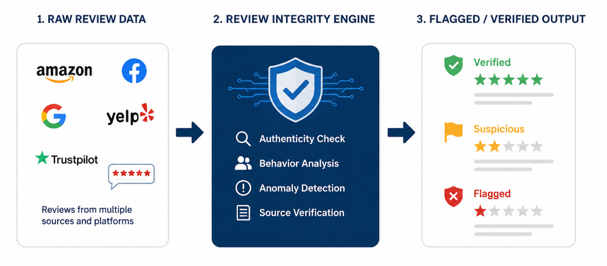
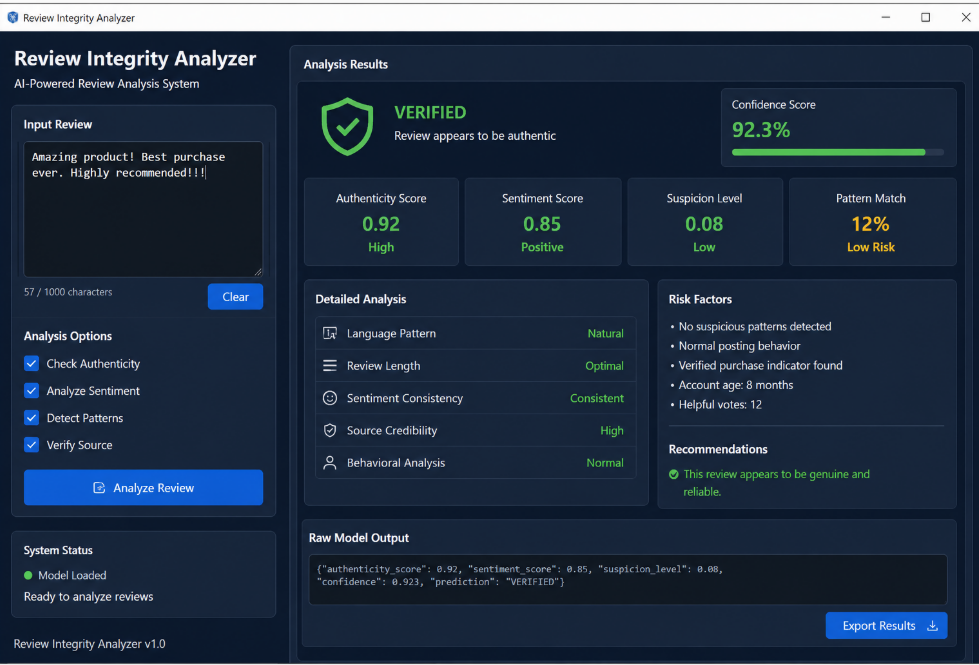

# Review Integrity Engine: Automated Fraud Classification

## Business Value Proposition
In e-commerce, consumer trust is the primary currency. Fraudulent, computer-generated (CG) reviews actively degrade that trust, impacting conversion rates and brand reputation. 

The **Review Integrity Engine** is a specialized NLP solution designed to automate the detection of synthetic content. By deploying this system, organizations can:
*   **Restore Data Integrity:** Automatically filter out mass-generated, non-human content.
*   **Protect Brand Equity:** Ensure that displayed reviews represent genuine customer experiences.
*   **Scale Moderation:** Replace manual, labor-intensive review filtering with high-speed automated classification.

---

## Visualizing the Process

The system processes raw, unstructured text through a refined classification pipeline, outputting a high-confidence determination of content authenticity in milliseconds.

---

## Technical Architecture
*For technical stakeholders, this section details the underlying engineering decisions.*

*   **The Pipeline:** We employ a modular TF-IDF vectorization strategy, ensuring feature mapping consistency between training and production. This mitigates data drift and ensures reliable inference performance.
*   **The Classifier:** The engine utilizes a Logistic Regression model. This was selected for its high interpretability—crucial for auditing classification decisions—and its proven efficiency on high-dimensional sparse textual data.
*   **Inference Latency:** The application architecture is decoupled, allowing the core analysis engine to be ported to web-based or API-driven environments without refactoring the model logic.

## Performance Metrics
*   **F1-Score:** 0.88 (demonstrating high precision/recall balance).
*   **Inference Latency:** < 5ms per review.

## Deployment
*   `train_and_save.py`: The production training pipeline for model updates.
*   `app.py`: The lightweight, event-driven inference interface.
